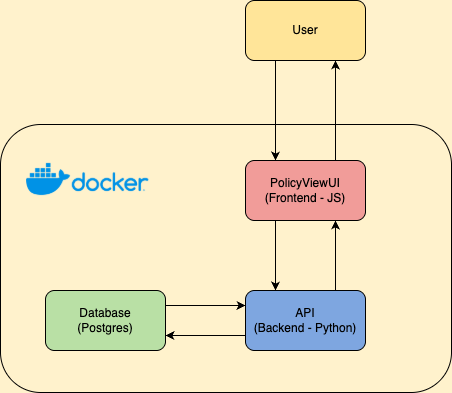

### Insurance Underwriting Project 
This project consists of a Frontend, Backend API, and Database components that together, allows users to
retrieve and display insurance policy data.

- Frontend: `HTML, CSS, JS`
- Backend API: `Python, FastAPI`
- Database: `Postgres`

For high level overview see HLD below 

### Setup
* Pre-requisites 
  * Install Docker, or Podman (including `docker-compose`, or `podman-compose` respectively)
* Run
  1. If you are not using an ARM architecture system (i.e. Mac with Apple Silicon)
     * You may need to comment out "platform: linux/arm64" in the `docker-compose.yml` file
  2. `docker-compose down -v`
  3. `docker-compose up --build`
     * Confirm all 3 containers are running   

### Usage
* Interact with Swagger/OpenAPI docs
  * `http://localhost:8000/docs#/`
* Interact with Frontend
  * `http://localhost:8080/`

### High Level Diagram

### Additional Considerations
* "If applicable, mention any potential improvements or optimizations."
  * The exercise only mentioned offering "read" functionality, however an improvement would be to create additional
  `POST, DELETE, and UPDATE` endpoints. Including also updating the frontend to offer post, delete and update functionality.
* "Also think of providing an automated way of checking if functionality is working."
  * If I had more time, I would have added a unit and integration test. Then use GitHub Action to create a simple workflow
  that would trigger these tests when a PR is raised to the Main branch. This would be an automated way of checking
  if the functionality is still working after changes have been made.
