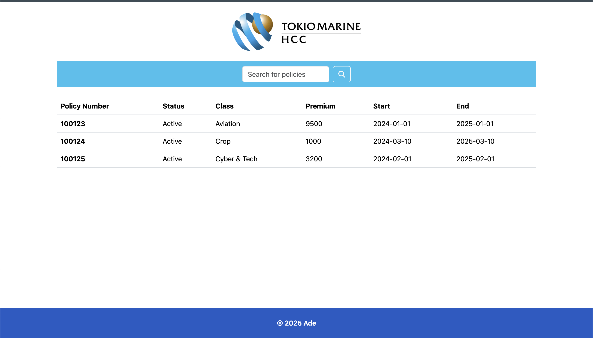

### Frontend

Simple frontend written in HTML, CSS and JS

Currently only offers two functionality
1. Retrieves and displays all insurance policy data (on page load)
2. Search specifically by policy number

